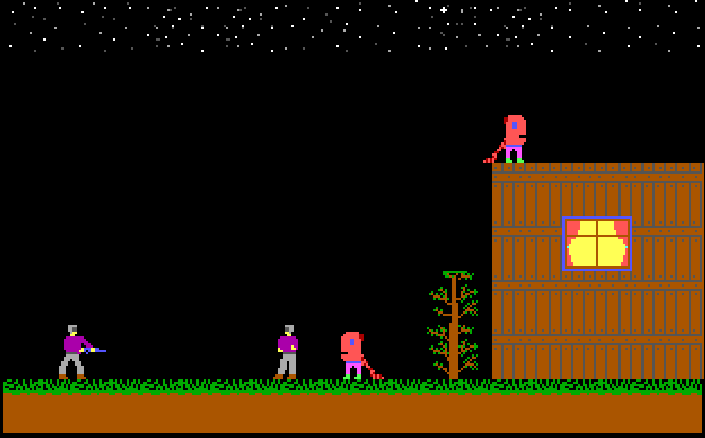

# Dark Planet — DOS Game (1998) · Windows Port

> Originally released in 1998. Reverse-engineered and ported to Delphi VCL in 2026.


---

## What is this

Dark Planet is a DOS side-scrolling action game originally written in Turbo Pascal using BGI256 graphics.
This repository contains a full Windows port — not a wrapper, not an emulator, but a clean rewrite in Delphi VCL that runs natively on modern Windows.

**Original game:** Alexander Friz ([@alexfrize](https://github.com/alexfrize) · [LinkedIn](https://www.linkedin.com/in/alexanderfriz/))
**All graphics and sprites:** Ilia Kusmin ([@rm3g25](https://github.com/rm3g25) · [LinkedIn](https://www.linkedin.com/in/kusmin-ilia/))
**Windows port:** Ilia Kusmin

---



## Why this is engineering, not just a port

The original code used DOS-specific techniques that have no direct equivalent in Windows:

**1. Banker's rounding killed the enemies**
Turbo Pascal `Round(2.5) = 3`. Delphi `Round(2.5) = 2`.
One digit difference — enemies walked straight through walls into the sky.
Fix: replaced `Round()` with `Trunc(x + 0.5)` to match original half-up behavior.

**2. Off-by-one shifted every sprite**
Delphi open array parameters are always 0-indexed, regardless of the caller's array bounds.
The entire sprite list was shifted by -1: earth tiles appeared in the sky, enemies showed wrong animation frames.
Fix: `N := 0` instead of `N := 1` in the file parser. One character. Hours of debugging.

**3. XOR rendering made corpses disappear**
DOS trick: draw a sprite twice with XOR = erase it. No memory needed, no cleanup.
Windows double buffering clears the canvas every frame — corpses vanished instantly.
Fix: full double-buffer architecture: `FBack` (static tiles) + `FBuf` (composited frame) → `StretchBlt`.

---

## What was rewritten

| Original (Turbo Pascal / DOS) | Port (Delphi VCL / Windows) |
|---|---|
| `PutImage` / `GetImage` (BGI256) | `TBitmap` + `BlitSprite` with index-0 transparency |
| `XORPut` rendering | Double buffer: FBack + FBuf |
| Direct `$A000` VGA memory | `StretchBlt` with 2x scale |
| Global variables | `TForm1` class fields |
| `Repeat…Until KeyPressed` game loop | `TTimer` at 30ms |
| `Delay()` animation | Frame counter per sprite |
| DOS file I/O (`Assign`, `Reset`) | `TFileStream` |

The core game logic — collision formulas, enemy AI boundaries, animation state machine — is preserved exactly from the original.

---

## What was improved

- **Parabolic jump physics** — replaced linear pixel-per-tick with velocity + gravity (`FVelY += 0.55` per tick)
- **Shoot while jumping** — with correct frozen-Y hit detection at the moment of firing
- **Alt+Enter fullscreen** — scales to any resolution while preserving 320×200 aspect ratio with letterboxing
- **Title screen** — `CDRAGON.PIC` with fade-in text, matches original intro feel

---

## Controls

| Key | Action |
|---|---|
| `→` | Move right |
| `←` | Move left |
| `↑` | Jump |
| `Space` | Shoot (works mid-air) |
| `Alt+Enter` | Toggle fullscreen |
| `Esc` | Quit |

---

## How to run

1. Download the latest release zip from [Releases](../../releases)
2. Extract anywhere
3. Run `DPport.exe`

No installation, no dependencies. Single folder, runs on any Windows.

---

## How to build from source

**Requirements:** Delphi 12 or newer (Community Edition works)

1. Clone the repository
2. Open `src/DPport.dpr`
3. Build (`Ctrl+F9`) — exe compiles to the project root next to the game assets
4. Run

---

## Repository structure

```
dark-planet/
  src/
    DPport.dpr
    DPport.dproj
    GameMain.pas
    GameMain.dfm
  SPRITES.NEW/
    *.IMG          -- all game sprites (graphics by Ilia Kusmin)
  LEVEL1.SF!       -- level 1 scenario
  LEVEL1.ITM       -- tile list
  LEVEL1.STF       -- enemy sprite list
  LEVEL2.SF!       -- level 2 scenario
  CDRAGON.PIC      -- title screen image
  README.md
  .gitignore
```

---

## About the original

Dark Planet was developed in 1998 using Turbo Pascal 7 with BGI256 graphics library.
The game ran in DOS VGA Mode 13h (320×200, 256 colors).
All sprites were drawn pixel-by-pixel using a custom DOS sprite editor — keyboard-only, no mouse.

---

*Port developed by [Ilia Kusmin](https://www.linkedin.com/in/kusmin-ilia/) · [iliakuzmin.dev](https://iliakuzmin.dev)*
